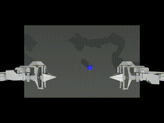

# OpenPi for Equinox

Inspired by: https://github.com/Physical-Intelligence/openpi.git

Motivation: Flax is hard to read and parse due to the stateful transforms hidden within code. Equinox offers a much more compelling abstraction that's python native and easy to understand.

Status:
- JAX/Equinox implementation of PaLI-Gemma 1/2, a multimodal language model from google combining PaLI and Gemma architectures: Tested and working
- Supports transfusion for efficient model adaptation: Tested and working
- Vision Language Action modeling with OpenPI weights: Tested and working
- A library implementation to generate text: Coming soon
- A library implementation to generate actions: Coming soon
- Finetuning: not planned in this repo
- Running on actual robot: not planned in this repo

Usage:
For language model: See the llm_test.py for example usage of the PaliGemma VLM.  

For OpenPi:
1. Get the awscli
2. download the model weights with the following command:
```bash
aws s3 cp s3://openpi-assets/checkpoints/pi0_aloha_sim/ ./pi0_aloha_sim/ --recursive --no-sign-request
```
3. See vla_test.py for example usage of Pi0 VLA model.  

